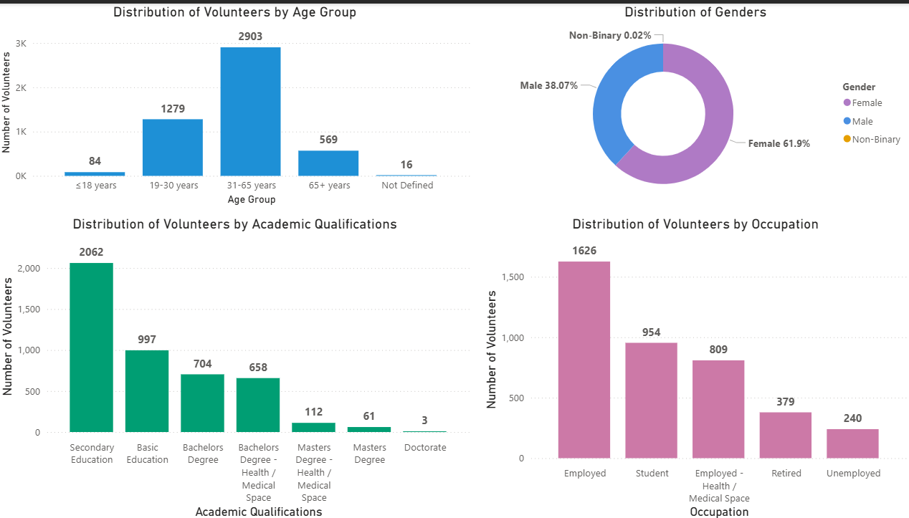
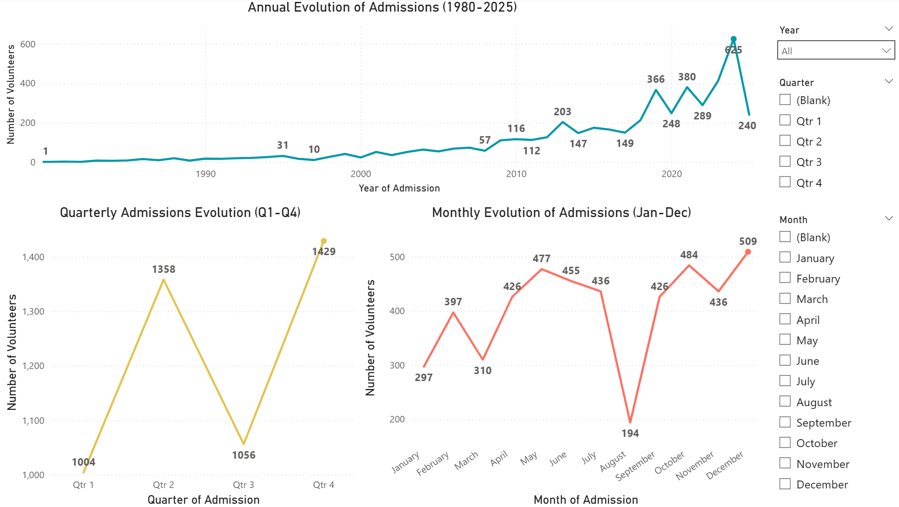

# 🧩 Red Cross Volunteer Data Project

Developed by **Fabio Da Silva Faria**, an aspiring Data Analyst transitioning from a successful background in recruitment into the data analytics space.  
This project demonstrates practical skills in data cleaning, transformation, visualization, and insight generation using real-world Red Cross volunteer data.

---

This project focuses on analyzing volunteer data for the Red Cross to identify demographic trends, service distribution, and regional engagement patterns.  
The dataset was cleaned and transformed using Excel and Power Query, visualized in Power BI, and summarized through key insights and visual dashboards.

---

## ⚙️ Data Cleaning (Excel + Power Query)

Initial data cleaning was performed in **Excel** to correct formatting issues and remove duplicates.  
Further transformation was done in **Power Query** to ensure consistency and prepare the dataset for visualization.  

Key transformations included:
- Standardizing column names and data types  
- Replacing inconsistent values  
- Filtering incomplete or inactive records  
- Creating calculated fields (e.g., volunteer tenure)  

Below is a snapshot of the Power Query *Applied Steps* panel:

---

## 📊 Dashboard Previews

Below are key visuals from the Power BI dashboard created for the Red Cross Volunteer Data Project:

### 1. Sociodemographic Distribution of Volunteers
Shows the gender and age composition of volunteers across all regions.  

### 2. Distribution by Seniority and Volunteering Area
Highlights how volunteer experience levels vary across different areas of service.  

### 3. Admission Date Trends
Displays the yearly trend of new volunteer admissions.  

### 4. Average Years of Service by Volunteering Area
Shows which volunteering areas retain volunteers the longest.  

### 5. Geographical Distribution of Volunteers
Maps volunteer distribution across major Portuguese districts.  

---

## 🧠 Tools Used
- **Excel** – initial cleaning and data formatting  
- **Power Query** – transformation and preparation  
- **Power BI** – visualization and dashboard creation  
- **PowerPoint** – presentation and storytelling  

---

## 💡 Key Insights
- Balanced gender distribution, but some age groups are underrepresented  
- Volunteers in *social/general* areas show the most longevity  
- Certain districts (like Braga) outperform expectations relative to population size  

---

## 📁 Project Structure
